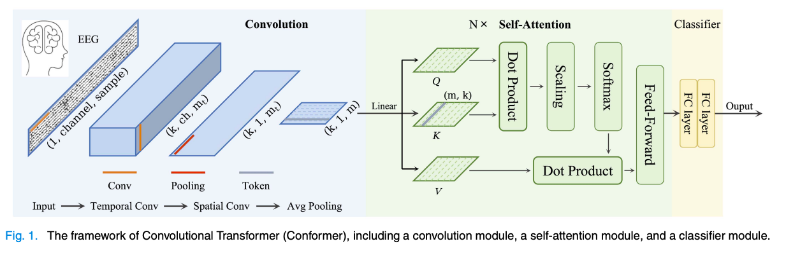

<!-- PROJECT SHIELDS -->
[![Contributors][contributors-shield]][contributors-url]
[![Forks][forks-shield]][forks-url]
[![Stargazers][stars-shield]][stars-url]
[![Issues][issues-shield]][issues-url]
[![MIT License][license-shield]][license-url]
[![LinkedIn][linkedin-shield]][linkedin-url]

<!-- PROJECT LOGO -->
 

<h3 align="center">Emotions classifier Model from Brain EEG Signals </h3>

  

<!--     <a href="https://github.com/ahmed-alllam/Brain-EEG-Emotion-Classifier">View Demo</a> -->
<!--     · -->
    <a href="https://github.com/ahmed-alllam/Brain-EEG-Emotion-Classifier/issues">Report Bug</a>
    ·
    <a href="https://github.com/ahmed-alllam/Brain-EEG-Emotion-Classifier/issues">Request Feature</a>
  

<!-- ABOUT THE PROJECT -->

## About The Project

The **Emotions classifier Model from Brain EEG Signals** project focuses on developing a model for classifying emotions based on brain EEG signals. The project employs a combination of deep learning and machine learning techniques to achieve accurate emotion classification. The model's architecture includes both Convolutional Neural Network (CNN) and Transformer components, inspired by the **EEG Conformer** architecture introduced by Song et al. in their 2023 IEEE paper[^1^].

### Features:

The project offers the following features:

- Utilizes a hybrid architecture combining Convolutional Neural Network (CNN) and Transformer components for effective EEG-based emotion classification[^1^].
- Implements various machine learning models, including Logistic Regression, Support Vector Machine (SVM), Random Forest Classifier, and Multi-Layer Perceptron (MLP) Neural Network, to compare performances.
- Employs data visualization using tools like Seaborn to gain insights into EEG signal characteristics.

 

## Data Source

The EEG data used for this project is sourced from a study that employed four dry extra-cranial electrodes via a commercially available MUSE EEG headband[^2^]. The EEG data was collected from two subjects (1 male, 1 female, aged 20-22) for each of the six emotional states (positive, negative, neutral) evoked by specific film clips. The dataset includes 324,000 data points collected from the brain's waves, which were resampled to 150Hz. Neutral brainwave data was also collected, serving as a third class representing the resting emotional state of the subjects. The EEG data was recorded from four electrodes (TP9, AF7, AF8, TP10) and was processed to generate a dataset of statistical features extracted through a sliding window of 1 second, beginning at t=0 and t=0.5[^2^]. This resulted in a dataset with both EEG features and emotion labels.

## Tech Stack

The project utilizes the following technologies and libraries:

- 
- 
- 
- 

## Contact

Ahmed Allam - [LinkedIn][linkedin-url] - ahmedeallam@aucegypt.edu

### References

[^1^]: Song, Yonghao et al. "EEG Conformer: Convolutional Transformer for EEG Decoding and Visualization." IEEE Transactions on Neural Systems and Rehabilitation Engineering 31 (2023): 710-719.
[^2^]: Bird, Jordan et al. "Mental Emotional Sentiment Classification with an EEG-based Brain-machine Interface." Proceedings of a Conference (2019).

<!-- MARKDOWN LINKS & IMAGES -->
[contributors-shield]: https://img.shields.io/github/contributors/ahmed-alllam/Brain-EEG-Emotion-Classifier.svg?style=for-the-badge
[contributors-url]: https://github.com/ahmed-alllam/Brain-EEG-Emotion-Classifier/graphs/contributors
[forks-shield]: https://img.shields.io/github/forks/ahmed-alllam/Brain-EEG-Emotion-Classifier.svg?style=for-the-badge
[forks-url]: https://github.com/ahmed-alllam/Brain-EEG-Emotion-Classifier/network/members
[stars-shield]: https://img.shields.io/github/stars/ahmed-alllam/Brain-EEG-Emotion-Classifier.svg?style=for-the-badge
[stars-url]: https://github.com/ahmed-alllam/Brain-EEG-Emotion-Classifier/stargazers
[issues-shield]: https://img.shields.io/github/issues/ahmed-alllam/Brain-EEG-Emotion-Classifier.svg?style=for-the-badge
[issues-url]: https://github.com/ahmed-alllam/Brain-EEG-Emotion-Classifier/issues
[license-shield]: https://img.shields.io/github/license/ahmed-alllam/Brain-EEG-Emotion-Classifier.svg?style=for-the-badge
[license-url]: https://github.com/ahmed-alllam/Brain-EEG-Emotion-Classifier/blob/master/LICENSE.txt
[linkedin-shield]: https://img.shields.io/badge/-LinkedIn-black.svg?style=for-the-badge&logo=linkedin&colorB=555
[linkedin-url]: https://linkedin.com/in/ahmed-e-allam
[product-screenshot]: images/screenshot.png
